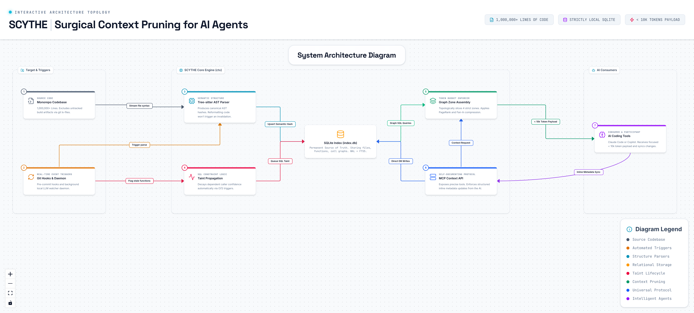

SCYTHE (ctx) — Surgical Context Pruning for AI Agents

Scythe (ctx) is a live, auto-updating relational codebase context engine. It
maintains a strictly local SQLite graph of your codebase that dynamically
updates during development, ensuring a comprehensive context payload of
under 10,000 tokens for repositories of any scale (even 1M+ LOC) [1].

SCYTHE Architecture Diagram

Key Features

  - Surgical Context Assembly: Automatically slices your codebase into four
    context zones (Focus Area, Direct Interface, Call Graph, and Guardrails)
    using Personalized PageRank on symbol dependency graphs and topological
    directory tree folding [1].
  - Active Model Sync (MCP): AI models (such as Claude Code) execute direct
    write-back API calls to update the database at the moment of code
    modification while the changes are fresh in their active context window [1].
  - Semantic AST Hashing: Employs Tree-sitter parsers to calculate
    formatting-insensitive structural hashes. Changing indentation, comments, or
    docstrings does not invalidate metadata, preventing false synchronization
    flags.
  - Taint Propagation & Decay: When a core function signature is modified,
    downstream callers are flagged in SQLite as tainted, notifying the AI in its
    next session to review those specific dependents [1].
  - Absolute Gitignore Fidelity: Resolves repository file lists via git ls-files
    to exclude build outputs, caches, and untracked files automatically.
  - Local Daemon & LLM Fallback: A background file watcher detects edits made
    outside MCP-enabled tools and runs asynchronous updates using a local,
    quantized model (such as Qwen2.5-Coder-7B via Ollama).

Quick Start

Installation

pip install scythe-ctx

Initializing a Repository

Navigate to your project root and run:

ctx init

This command automatically:

1.  Discovers tracked project files using git ls-files.
2.  Spawns parallel worker pools to parse the Abstract Syntax Tree (AST) of each
    file.
3.  Maps imports, exports, and localized call graphs into the local database
    .ctx/index.db.
4.  Executes batched LLM calls to generate initial 1-sentence file purposes
    and 15-word function summaries.
5.  Installs Git pre-commit and post-commit hooks.
6.  Starts the local filesystem watcher daemon (ctx watch).

Configuration & Integration

Scythe operates as an MCP (Model Context Protocol) server. Add the server
configuration to your tool to integrate it with Claude Code, Claude Desktop, or
Cursor.

Claude Desktop / Claude Code (.mcp.json)

Add the following block to your MCP configuration file:

{
  "mcpServers": {
    "scythe-ctx": {
      "command": "ctx",
      "args": ["serve"]
    }
  }
}

CLI Command Reference

| Command                       | Description                                                               |
| :---------------------------- | :------------------------------------------------------------------------ |
| `ctx init`                    | Discovers project files, parses ASTs, and bootstraps the index.           |
| `ctx watch`                   | Starts the background filesystem watcher daemon.                          |
| `ctx serve`                   | Starts the MCP server interface for AI agents.                            |
| `ctx update <file>`           | Forces a manual metadata update for a specific file.                      |
| `ctx sync`                    | Evaluates stale AST nodes and batch-updates modified files.               |
| `ctx validate`                | Checks staged files in Git against database hashes (runs in \<50ms).      |
| `ctx status`                  | Prints index statistics, taint queue depth, and confidence ratings.       |
| `ctx search <query>`          | Performs fast FTS5 full-text search over recorded summaries.              |
| `ctx decision <scope> <text>` | Records a persistent architectural design constraint.                     |
| `ctx danger <scope> <text>`   | Adds a manual invariant warning block to the scope.                       |
| `ctx export`                  | Compiles SQLite tables into read-only markdown files (`CLAUDE.md`, etc.). |
| `ctx graph <file>`            | Generates and prints the import dependency graph of a file.               |

Relational Database Schema (.ctx/index.db)

All index metadata resides in a local SQLite database using Write-Ahead Logging
(WAL) to optimize parallel read/write performance [1].

Files Table (files)

Tracks file-level purposes, dependencies, and synchronization states.

| Column          | Type    | Description                                           |
| :-------------- | :------ | :---------------------------------------------------- |
| `path`          | TEXT    | Primary Key. Relative file path from repo root.       |
| `system`        | TEXT    | Architectural subsystem (e.g., "auth", "mcts").       |
| `purpose`       | TEXT    | One-sentence summary explaining why this file exists. |
| `exports`       | TEXT    | JSON array of exported symbols.                       |
| `imports`       | TEXT    | JSON array of imported file paths.                    |
| `used_by`       | TEXT    | JSON array of dependent files (capped at 15).         |
| `used_by_count` | INTEGER | Exact dependent count across the workspace.           |
| `summary`       | TEXT    | Fallback sentence for deep pruning states.            |
| `danger`        | TEXT    | Critical file-level invariant.                        |
| `last_change`   | TEXT    | Short summary of the last semantic edit.              |
| `semantic_hash` | TEXT    | Formatting-insensitive AST hash.                      |
| `content_hash`  | TEXT    | Raw SHA-256 hash.                                     |
| `confidence`    | REAL    | Rating (0.0 to 1.0) indicating metadata drift.        |
| `is_stale`      | INTEGER | Flagged when code changes are detected on disk.       |

Functions Table (functions)

Holds function-level declarations and taint states.

| Column         | Type    | Description                                             |
| :------------- | :------ | :------------------------------------------------------ |
| `id`           | TEXT    | Primary Key (`path::ClassName.method_name`).            |
| `file`         | TEXT    | Foreign Key pointing to `files.path`.                   |
| `class_name`   | TEXT    | Class name context, if applicable.                      |
| `name`         | TEXT    | Raw function or method name.                            |
| `signature`    | TEXT    | Full signature details including type hints.            |
| `summary`      | TEXT    | Core description restricted to a 15-word maximum.       |
| `summary_long` | TEXT    | Two-sentence fallback description for Zone 0.           |
| `mutates`      | TEXT    | JSON array of state variables modified by the function. |
| `danger`       | TEXT    | Critical localized invariant.                           |
| `is_tainted`   | INTEGER | Set to 1 if downstream callee signatures change \[1\].  |
| `taint_source` | TEXT    | ID of the function that triggered the taint \[1\].      |

Relational Mapping Tables

  - call_graph: Maps caller_id to callee_id and tracks dynamic
    dispatch/duck-typing ambiguity via a candidate list.
  - dangers: Stores manual, human-curated architectural invariants that survive
    automated AST regenerations.
  - changes: Retains a rolling log of the last 20 semantic changes per file.
  - session_log: Houses active task summaries to preserve the agent's short-term
    working memory across chat boundaries.
  - decisions: Tracks architectural design choices, warning AI agents against
    undoing explicit decisions.
  - directories: Caches top-level directory file counts and high-level folders
    summaries to enable topological tree-folding.

Context Assembly Algorithm

Scythe constructs context dynamically based on the active focal point (the file
and line number currently under edit):

Layer 3: Architectural Guardrails (~800 Tokens)

  - Reads the folded directory tree (displays the full structure of the active
    directory; folds all other directories into single-line folders counts and
    purpose summaries).
  - Pulls active system-wide invariants (scope="*") and relevant decisions.
  - Appends the last 3 session log entries to restore the AI agent's immediate
    task memory.

Layer 0: Active Focus Area (~2,500 Tokens)

  - Loads full metadata for the target file.
  - Lists detailed records for functions inside the target file (paginated to
    the 20 nearest functions if the file contains more than 30 declarations).
  - Appends active taint warnings.

Layer 1: Direct Interface (~2,000 Tokens)

  - Locates the imports and PageRank-ranked dependents of the focus file.
  - Applies Fan-In Compression: if a dependent file's import count is greater
    than 15, collapses the path list into a generic summary count, protecting
    the token budget.
  - Pulls file-scoped danger warnings.

Layer 2: Local Call Graph (~1,500 Tokens)

  - Fetches functional signatures and summaries of calling and called symbols
    exactly 1 level deep.

Adaptive Token Budget Pruning

If the assembled context exceeds 8,000 tokens, the engine applies four cascading
compression steps to guarantee payload limits:

1.  Summary Compaction: Swaps long multi-sentence function summaries for
    short, 15-word variants (Saves ~30% of Zone 0/2).
2.  Zone 1 Collapse: Flattens dependencies into single-line lists, omitting
    export and import detail arrays (Saves ~60% of Zone 1).
3.  Zone 2 Truncation: Strips summaries from calling targets, retaining only
    names, signatures, and file paths (Saves ~50% of Zone 2).
4.  Zone 0 Pagination: Limits functions shown to the 15 nearest to the active
    line context, inserting helper fetch alerts for the model.

Active Update Workflow

Scythe relies on AI models to maintain index hygiene during active developer
sessions. When the agent is initialized inside the repository, the system prompt
instructs the model to follow a strict write-back workflow:

                  ┌──────────────────────────────┐
                  │      Agent Reads Context     │
                  │      (ctx.get_context)       │
                  └──────────────┬───────────────┘
                                 │
                     Agent Executes Code Edit
                                 │
                                 ▼
                  ┌──────────────────────────────┐
                  │    Agent Writes to Disk      │
                  └──────────────┬───────────────┘
                                 │
                     Agent Updates Code Index
                                 │
                                 ▼
         ┌────────────────────────────────────────────────┐
         │  1. ctx.update_file(path, purpose, danger)     │
         │  2. ctx.update_function(id, summary, mutates)  │
         │  3. ctx.log_session(current_status_summary)    │
         └────────────────────────────────────────────────┘

This updates SQLite instantly, maintaining zero-drift code mapping with zero
background parsing overhead.

Git Lifecycle Integration

Git-Index Native Discovery

Scythe queries the Git index directly using git ls-files during initialization
and background watches. This ensures perfect .gitignore compliance out of the
box and prevents build directories (node_modules, .venv, dist, target) from
cluttering the index or consuming resources.

Pre-Commit Verification

The git pre-commit hook runs in O(M) time where M is the number of staged files,
not the size of the repository:

1.  It queries staged files via git diff --cached --name-only.
2.  It computes the semantic AST hashes of those staged files.
3.  If they differ from the database (meaning code changes were made without
    executing index write-backs), the commit is blocked, prompting the developer
    to run ctx sync or update the indexes. This validation pipeline runs in
    under 30ms.

License

Scythe is open-source software licensed under the Apache-2.0 License.
